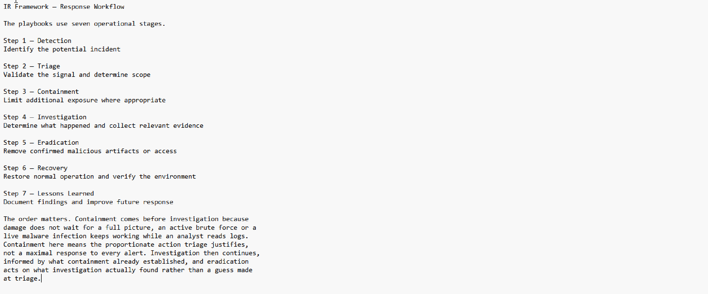
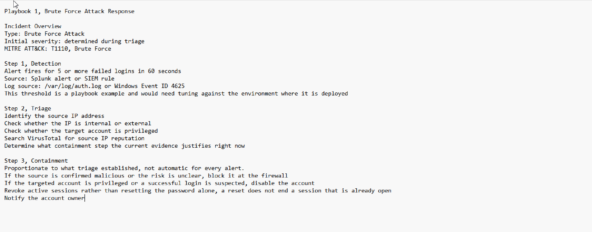
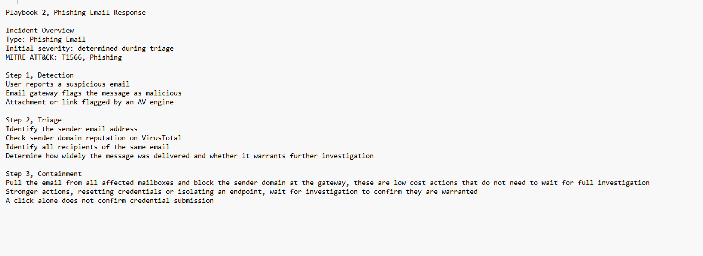
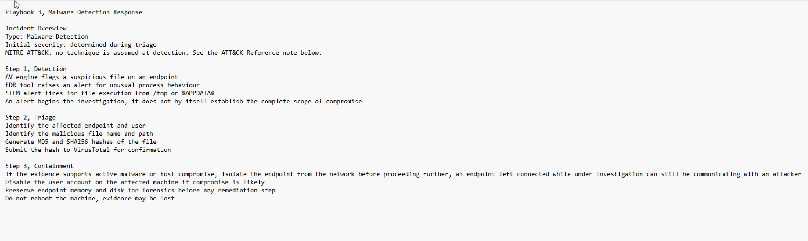
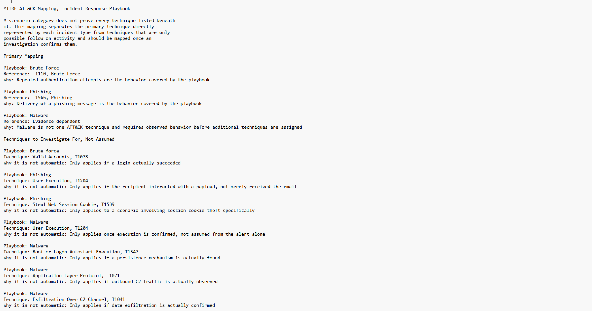
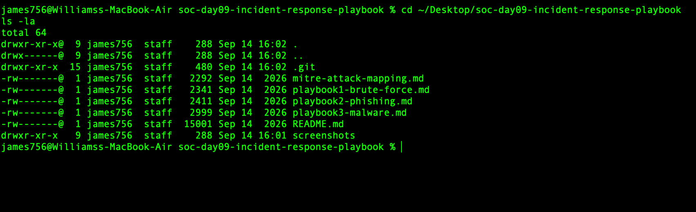

# Day 09 – SOC Tier 1 Incident Report: Incident Response Playbook Development

---

## Incident Summary

- **Incident Type:** Incident Response Playbook Development & Standardization
- **Severity:** High (Production-Grade SOC Documentation)
- **Detection Method:** N/A Proactive IR Capability Build
- **Tools Used:** NIST SP 800-61 IR Framework, MITRE ATT&CK Framework v14, Markdown Documentation
- **Status:** Complete 3 Playbooks Operational, 9 ATT&CK Techniques Mapped

---

## Executive Summary

This investigation delivers three production-grade Incident Response playbooks covering the most common incident types encountered by a SOC Tier 1 analyst: brute-force attacks, phishing emails, and malware detections. Each playbook is built on the NIST SP 800-61 7-step IR framework and fully mapped to MITRE ATT&CK techniques.

The deliverables provide a standardized, repeatable response methodology that ensures consistent analyst decision-making under pressure, supports evidence preservation, and aligns response actions with adversary tactics for ongoing detection improvement.

---

## Affected System

- **Scope:** SOC Tier 1 Operational Procedures
- **Framework Basis:** NIST SP 800-61 Incident Handling Guide
- **Threat Intelligence Source:** MITRE ATT&CK Enterprise Matrix v14
- **Coverage:**
  - 3 incident categories (Brute Force, Phishing, Malware)
  - 9 MITRE ATT&CK techniques
  - Full 7-step IR lifecycle per playbook

---

## Investigation Methodology

---

### 1. IR Framework Review



- Reviewed NIST SP 800-61 Incident Handling Guide
- Established the 7-step IR lifecycle as the playbook foundation
- Aligned terminology with industry-standard SOC vocabulary

### SOC Observations:

- Standardized frameworks ensure consistent analyst response
- NIST SP 800-61 is the recognized industry baseline for IR
- Framework alignment supports audit, compliance, and handoff workflows

---

### 2. Playbook 1 — Brute Force Attack



- **Severity:** High
- **MITRE Technique:** T1110 Brute Force
- **Trigger Condition:** 5+ failed logins within 60 seconds from a single source

**7-Step Response:**
1. **Detection** — SIEM alert on failed authentication threshold
2. **Triage** — Validate source IP, target account scope, time window
3. **Containment** — Block source IP at firewall, disable targeted account
4. **Investigation** — Review authentication logs for successful logins from same source
5. **Eradication** — Reset compromised credentials, revoke active sessions
6. **Recovery** — Re-enable account with MFA enforced
7. **Lessons Learned** — Tune lockout thresholds, document attacker IP for threat intel

### SOC Observations:

- Brute-force playbooks must distinguish between failed and successful follow-up logins
- Session revocation is critical credential reset alone does not invalidate active sessions
- Source IP intelligence enriches future detection rules

---

### 3. Playbook 2 — Phishing Email



- **Severity:** High
- **MITRE Technique:** T1566 Phishing
- **Trigger Condition:** User report or email gateway alert

**7-Step Response:**
1. **Detection** — User-reported email or gateway-flagged message
2. **Triage** — Analyze sender, headers, links, and attachments
3. **Containment** — Pull email from all mailboxes, block sender domain at gateway
4. **Investigation** — Identify recipients, click rates, credential submission events
5. **Eradication** — Reset credentials for users who clicked, isolate affected endpoints
6. **Recovery** — Restore endpoint access after verification, enable MFA
7. **Lessons Learned** — User awareness training, gateway rule tuning, IOC sharing

### SOC Observations:

- Phishing response requires email-system mass action capabilities (e.g. Microsoft 365 message trace + soft delete)
- Click telemetry determines escalation scope
- Credential-harvesting phishing demands immediate password resets not just email purge

---

### 4. Playbook 3 — Malware Detection



- **Severity:** Critical
- **MITRE Technique:** T1204 User Execution
- **Trigger Condition:** AV / EDR alert on suspicious file or process

**7-Step Response:**
1. **Detection** — AV or EDR alert on suspicious file, hash, or behaviour
2. **Triage** — Validate alert, capture file hash, identify affected endpoint
3. **Containment** — Network isolate the endpoint immediately
4. **Investigation** — Submit hash to VirusTotal / Hybrid Analysis, identify persistence mechanisms, map lateral movement
5. **Eradication** — Remove malware, clear persistence artifacts (CRON, registry, services)
6. **Recovery** — Restore endpoint from clean backup, validate integrity before reconnecting
7. **Lessons Learned** — Update detection rules, share IOCs, refine endpoint hardening

### SOC Observations:

- Evidence preservation must precede remediation hash, memory capture, and disk image first
- Network isolation is non-negotiable for confirmed malware
- Restore-from-backup is the only fully trusted recovery path

---

### 5. MITRE ATT&CK Mapping Construction



- Mapped each playbook to corresponding ATT&CK tactics and techniques
- Built cross reference table linking incidents to adversary behaviours
- Validated coverage against MITRE ATT&CK Enterprise Matrix v14

### SOC Observations:

- ATT&CK mapping converts response procedures into threat-informed defense
- Each technique maps to specific detection rules gaps surface immediately
- Mapping enables continuous improvement as adversary TTPs evolve

---

### 6. Playbook Validation & Review



- Reviewed all three playbooks against NIST 7-step framework completeness
- Validated MITRE ATT&CK coverage per incident type
- Confirmed IOC capture, evidence preservation, and escalation paths

### SOC Observations:

- Playbooks must be reviewed against actual incident scenarios before deployment
- Each phase must produce documentable artifacts for audit and handoff
- Playbooks are living documents quarterly review is industry practice

---

## Indicators of Compromise (IOCs) by Playbook

| Playbook        | IOC Category              | Examples                                                |
|-----------------|---------------------------|---------------------------------------------------------|
| Brute Force     | Network IOCs              | Source IP, geolocation, ASN                             |
| Brute Force     | Authentication IOCs       | Failed login event IDs, target usernames, time windows  |
| Phishing        | Email IOCs                | Sender domain, subject line, message hash, URLs         |
| Phishing        | Behavioural IOCs          | Click events, credential submission, attachment hashes  |
| Malware         | File IOCs                 | MD5/SHA256 hashes, filename, file path                  |
| Malware         | Network IOCs              | C2 domains, IPs, beaconing intervals                    |
| Malware         | Host IOCs                 | Persistence registry keys, scheduled tasks, services    |

---

## MITRE ATT&CK Mapping

| Incident      | Tactic                | Technique                          | ID     |
|---------------|-----------------------|------------------------------------|--------|
| Brute Force   | Credential Access     | Brute Force                        | T1110  |
| Brute Force   | Defense Evasion       | Valid Accounts                     | T1078  |
| Phishing      | Initial Access        | Phishing                           | T1566  |
| Phishing      | Execution             | User Execution                     | T1204  |
| Phishing      | Credential Access     | Steal Web Session Cookie           | T1539  |
| Malware       | Execution             | User Execution                     | T1204  |
| Malware       | Persistence           | Boot or Logon Autostart Execution  | T1547  |
| Malware       | Command & Control     | Application Layer Protocol         | T1071  |
| Malware       | Exfiltration          | Exfiltration Over C2 Channel       | T1041  |

---

## IR Methodology — 7 Step Framework

| Step | Phase             | Purpose                                              |
|------|-------------------|------------------------------------------------------|
| 1    | Detection         | Identify the incident via alerts or user reports     |
| 2    | Triage            | Assess severity, scope, and validate the alert       |
| 3    | Containment       | Stop the spread and limit blast radius immediately   |
| 4    | Investigation     | Understand attacker actions, scope, and IOCs         |
| 5    | Eradication       | Remove the threat and all persistence artifacts      |
| 6    | Recovery          | Restore normal operations safely with validation     |
| 7    | Lessons Learned   | Document findings, improve detection, share IOCs     |

---

## SOC Analyst Findings

- Three production-grade IR playbooks delivered covering the most common SOC incidents
- All playbooks align with NIST SP 800-61 7-step framework
- Nine MITRE ATT&CK techniques mapped across the three incident types
- Evidence preservation and containment sequencing validated for each playbook
- Playbook structure supports analyst handoff, audit, and continuous improvement
- Critical actions (network isolation, session revocation, IOC capture) standardized across the suite

---

## SOC Analyst Response

- Deploy playbooks as the standard SOC Tier 1 response reference
- Train analysts on the 7-step IR framework using these playbooks as reference cases
- Integrate playbook trigger conditions into SIEM alert routing
- Schedule quarterly playbook reviews against new threat intelligence
- Capture IOCs from each invoked playbook into a central threat intel repository
- Use ATT&CK mappings to identify detection gaps and prioritize tuning
- Run tabletop exercises against each playbook to validate analyst execution

---

## Analyst Insight

Incident Response playbooks are the operational backbone of every professional SOC. Without them, analysts make inconsistent decisions under pressure missing containment steps, skipping evidence preservation, or recovering too early and reintroducing compromise. A well written playbook ensures that every analyst, regardless of experience level, follows the same proven methodology. MITRE ATT&CK mapping adds a second layer of value by linking each response action to real-world adversary tactics, making detection gaps visible and improvement priorities clear.

---

## Learning Outcome

This investigation demonstrates the ability to:

- Build production-grade Incident Response playbooks from scratch
- Apply the NIST SP 800-61 7-step IR framework to real world incident types
- Map response procedures to the MITRE ATT&CK framework
- Distinguish between containment and eradication phases with operational clarity
- Document incident specific IOCs across host, network, and identity layers
- Recognize evidence preservation as a non-negotiable IR principle
- Standardize SOC decision-making under pressure through structured procedures
- Translate threat intelligence into actionable response procedures

---

## Repository Structure

```
incident-response-playbook-lab/
├── README.md
├── playbook1-brute-force.md
├── playbook2-phishing.md
├── playbook3-malware.md
├── mitre-attack-mapping.md
└── screenshots/
    ├── ir_framework.png
    ├── playbook1_brute_force.png
    ├── playbook2_phishing.png
    ├── playbook3_malware.png
    ├── mitre_mapping.png
    └── final_playbooks.png
```

---

## Conclusion

This investigation delivers a professional IR playbook suite that demonstrates analytical depth, structured methodology, and MITRE ATT&CK fluency three competencies every SOC hiring manager evaluates. The deliverable is not a tool exercise but a standardized response capability: proof of analytical thinking, framework alignment, and operational SOC readiness.
