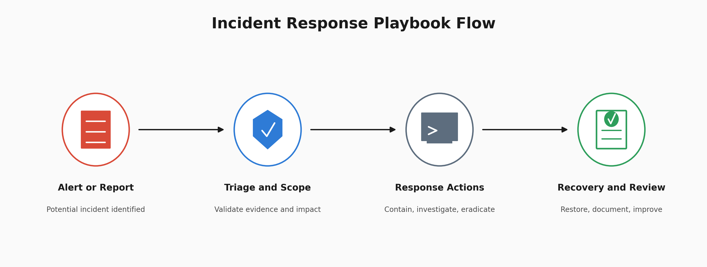

# Incident Response Playbooks, Detection to Containment

I built three incident response playbooks for brute force, phishing, and malware incidents, using a structured response lifecycle and MITRE ATT&CK to connect common incident types with relevant adversary techniques.



The project focuses on what happens after a potential incident is identified.

**Alert or Report → Triage and Scope → Response Actions → Recovery and Review**

The playbooks are procedures for guiding response. They were reviewed as documentation, not executed against production incidents.

## At a Glance

| Field | Detail |
| --- | --- |
| Deliverable | 3 incident response playbooks |
| Coverage | Brute force, phishing, malware |
| Response Model | Detection, triage, containment, investigation, eradication, recovery, lessons learned |
| Threat Framework | MITRE ATT&CK |
| Validation | Documentation review |
| Type | Incident response documentation build |

## What I Built

The repository contains three incident specific playbooks:

1. Brute force response
2. Phishing email response
3. Malware response

Each playbook follows the same general response structure while changing the investigation and response actions for the incident type.

The goal was not to document an incident that already happened.

The goal was to build procedures that an analyst could use when a similar alert or report arrives.

## Response Workflow

The playbooks use seven operational stages.

| Step | Stage | Purpose |
| --- | --- | --- |
| 1 | Detection | Identify the potential incident |
| 2 | Triage | Validate the signal and determine scope |
| 3 | Containment | Limit additional exposure where appropriate |
| 4 | Investigation | Determine what happened and collect relevant evidence |
| 5 | Eradication | Remove confirmed malicious artifacts or access |
| 6 | Recovery | Restore normal operation and verify the environment |
| 7 | Lessons Learned | Document findings and improve future response |

The order matters. Containment comes before investigation because damage does not wait for a full picture, an active brute force or a live malware infection keeps working while an analyst reads logs. Containment here means the proportionate action triage justifies, not a maximal response to every alert. Investigation then continues, informed by what containment already established, and eradication acts on what investigation actually found rather than a guess made at triage.

Each stage should still answer a different response question.

Detection asks what triggered the investigation.

Triage asks whether the signal is credible, what is affected, and what containment step that justifies right now.

Containment limits exposure to the degree the current evidence supports.

Investigation determines what the available evidence supports, informed by what containment already revealed.

Eradication and recovery are then based on that evidence rather than applied automatically to every alert.

Lessons learned turns the incident into improvements for the next investigation.

---

## Playbook 1, Brute Force Response


The brute force playbook begins with repeated authentication failures.

### Detection

Review the authentication alert or relevant authentication logs.

The documented example uses a threshold of five or more failed logins within 60 seconds as a possible trigger condition.

This threshold is a playbook example and would need tuning against the environment where it is deployed.

### Triage

Identify:

* Source IP
* Target account
* Number of failures
* Time window
* Whether the account is privileged
* Whether the source is expected

### Containment

Containment here is proportionate to what triage established, not automatic for every alert.

If the source is confirmed malicious or the risk is unclear, block it at the firewall. If the targeted account is privileged or a successful login is suspected, disable the account and revoke active sessions rather than resetting the password alone, a reset does not end a session that is already open.

### Investigation

Search the same authentication telemetry for additional activity involving the source and targeted account.

A key question is whether failed authentication was followed by successful authentication. This is the finding that decides whether this is noise or a breach.

Also determine whether the activity targeted one account or multiple accounts.

### Eradication and Recovery

If account compromise is confirmed, response can include credential reset and active session revocation where that has not already happened during containment.

Account access should be restored after the response actions are validated.

### Evidence to Document

* Source IP
* Target username
* Authentication timestamps
* Number of failed attempts
* Successful authentication events if present
* Containment actions taken

### ATT&CK Reference

**T1110, Brute Force**

The playbook references this technique because repeated password attempts are the behavior being investigated.

---

## Playbook 2, Phishing Email Response


The phishing playbook begins with a suspicious email reported by a user or identified by email security controls.

### Detection

Start with the reported message or security alert.

### Triage

Review:

* Sender
* Sender domain
* Email headers
* URLs
* Attachments
* Recipients

The goal is to determine whether the message warrants additional investigation and how widely it was delivered.

### Containment

Pulling the email from affected mailboxes and blocking a confirmed malicious sender domain are low cost actions that do not need to wait for full investigation.

Stronger actions, resetting credentials or isolating an endpoint, should wait for investigation to confirm they are warranted, since a click alone does not confirm credential submission.

### Investigation

Determine:

* Who received the message
* Whether anyone clicked a link
* Whether an attachment was opened
* Whether credentials may have been submitted
* Whether related activity appears in available endpoint or network telemetry

Suspicious domains, URLs, IP addresses, and file hashes can also be checked using appropriate threat intelligence sources.

### Eradication and Recovery

If credential compromise is established, affected credentials and sessions should be addressed.

If endpoint compromise is established, endpoint response procedures should follow.

Recovery depends on what the investigation found rather than simply on the original phishing email.

### Evidence to Document

* Sender
* Sender domain
* Subject
* Relevant headers
* URLs
* Attachment hashes
* Recipient list
* Click activity if available
* Credential exposure if established

### ATT&CK Reference

**T1566, Phishing**

The playbook uses phishing as the primary ATT&CK behavior because that is the incident type directly covered by the procedure.

---

## Playbook 3, Malware Response


The malware playbook begins with a suspicious file or endpoint security alert.

### Detection

Potential sources include antivirus, EDR, SIEM, or another security control.

An alert begins the investigation. It does not by itself establish the complete scope of compromise.

### Triage

Identify:

* Affected endpoint
* User
* File name
* File path
* Available hash values
* Detection source
* Relevant alert details

Hashes can be checked against threat intelligence services where appropriate.

### Containment

If the evidence supports active malware or host compromise, isolate the endpoint from the network before proceeding further. An endpoint left connected while under investigation can still be communicating with an attacker.

Preserve endpoint memory and disk for forensics before any remediation step, and do not reboot the machine, evidence may be lost.

### Investigation

Review available host evidence for signs of impact.

Relevant areas can include:

* Running processes
* Network connections
* Persistence mechanisms
* File system artifacts
* Relevant endpoint logs

The exact investigation depends on the telemetry available. Treat persistence, command and control, and exfiltration as things to investigate for, not techniques to assume occurred.

### Eradication

Remove confirmed malicious artifacts and persistence mechanisms.

The required actions depend on what the investigation actually identified.

### Recovery

Restore the endpoint to a trusted state from a known clean backup.

Validate the system before returning it to normal operation.

Continue monitoring where appropriate.

### Evidence to Document

* File name and path
* MD5 or SHA256 where available
* Endpoint
* User
* Relevant process activity
* Network indicators
* Persistence artifacts
* Response actions

### ATT&CK Reference

A malware alert does not automatically prove a particular ATT&CK technique.

Techniques should be mapped when the observed behavior supports them rather than assigned solely because an incident is categorized as malware.

---

## MITRE ATT&CK Mapping


The original mapping document explores several techniques that could appear during brute force, phishing, and malware incidents.

For the final portfolio presentation, I separate **directly represented incident behavior** from techniques that are only possible follow on activity.

| Playbook | Primary ATT&CK Reference | Why |
| --- | --- | --- |
| Brute Force | T1110, Brute Force | Repeated authentication attempts are the behavior covered by the playbook |
| Phishing | T1566, Phishing | Delivery of a phishing message is the behavior covered by the playbook |
| Malware | Evidence dependent | Malware is not one ATT&CK technique and requires observed behavior before additional techniques are assigned |

Techniques such as Valid Accounts, User Execution, persistence, Command and Control, or Exfiltration can become relevant during an investigation.

They should not be treated as confirmed simply because they are possible outcomes of the incident type.

This keeps ATT&CK mapping tied to evidence.

---

## Playbook Validation


The three playbooks were reviewed as documentation against the response stages used in the project.

The review checked whether each procedure addressed:

* Detection
* Triage
* Containment
* Investigation
* Eradication
* Recovery
* Lessons learned
* IOC documentation

This was a paper review.

The playbooks were not battle tested against live production incidents, so the project does not claim operational validation.

A stronger next step would be to run tabletop exercises and record where the procedures become unclear or require additional decision points.

---

## IOC Categories by Playbook

| Playbook | Category | What to Capture |
| --- | --- | --- |
| Brute force | Network | Source IP and relevant network context |
| Brute force | Authentication | Failed events, target usernames, timestamps |
| Phishing | Email | Sender, domain, subject, headers, URLs |
| Phishing | User activity | Click activity and credential exposure if available |
| Phishing | File | Attachment hashes where applicable |
| Malware | File | MD5, SHA256, filename, path |
| Malware | Network | Relevant domains and IP addresses |
| Malware | Host | Processes, persistence artifacts, services, scheduled tasks |

The exact evidence available will vary between incidents.

The playbook should document what was actually observed rather than filling every IOC category simply because the field exists.

---

## Recommended Deployment

These playbooks are documentation artifacts rather than production automation.

To move them closer to operational use, I would:

* Connect appropriate playbooks to SIEM alert workflows
* Test each playbook through tabletop exercises
* Define clear Tier 1 escalation criteria
* Tune trigger thresholds against normal environment activity
* Record response evidence consistently
* Review ATT&CK mappings when investigation evidence changes
* Periodically review the procedures as tooling and telemetry change

---

## What This Lab Demonstrates

This project demonstrates a different part of SOC work from my earlier investigation labs.

Instead of investigating one completed event, I documented how an analyst could approach future incidents consistently.

The project demonstrates:

* Incident response procedure development
* Triage and scoping logic
* Evidence driven response decisions
* IOC documentation
* ATT&CK awareness
* Containment decision making
* Escalation thinking
* Recovery planning

The central lesson is that a playbook should guide decisions without pretending every incident will follow exactly the same path.

---

## Repository Structure

```text
.
├── README.md
├── playbook1-brute-force.md
├── playbook2-phishing.md
├── playbook3-malware.md
├── mitre-attack-mapping.md
└── screenshots/
    ├── 00_architecture.png
    ├── ir_framework.png
    ├── playbook1_brute_force.png
    ├── playbook2_phishing.png
    ├── playbook3_malware.png
    ├── mitre_mapping.png
    └── final_playbooks.png
```

## Lessons Learned

Writing the three playbooks showed me that the same response action can be correct in one incident and premature in another.

Blocking an IP, disabling an account, isolating an endpoint, resetting credentials, or deleting a file can all be legitimate actions.

The important question is whether the investigation has established enough evidence to justify that action, and separately, whether the specific action is urgent enough to happen before that evidence is complete. Those turned out to be two different questions, not one.

A useful playbook should not only tell an analyst what actions are available. It should help the analyst understand when those actions are appropriate, and which ones cannot wait.

## What I Would Improve

I would run a tabletop exercise against each playbook instead of relying only on documentation review.

That would test whether another analyst can follow the procedures without needing the assumptions that were in my head when I wrote them.

I would also add explicit escalation criteria for Tier 1 analysts.

For example, successful authentication following repeated failures, confirmed credential submission after phishing, or evidence of active host compromise should lead to clearly documented escalation paths.

---

## Author

William Gokah

SOC Analyst Portfolio

[](https://linkedin.com/in/WilliamInCyber)
[](https://x.com/WilliamInCyber)
